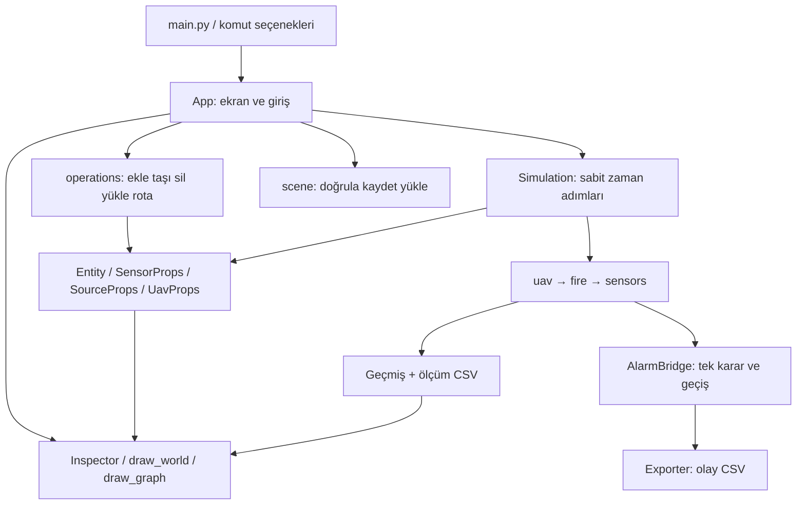

# IoT Deney Atölyesi — Türkçe proje rehberi

Bu rehber model `education-2.0` sürümünü anlatır. Proje, bir ayarı değiştirip ölçüm ve alarm üzerindeki etkisini gözlemleyerek öğrenmek içindir. Önce kullanımı, sonra bu davranışı üreten kodu takip edeceğiz.

[Bütün dosya ve sembollerin kaynakla eşleştirilmiş eki](docs/KOD_REHBERI.md) bu rehberin parçasıdır. Ekte her Python dosyasının dosya düzeyindeki blokları, sınıfları, fonksiyonları, iç fonksiyonları, girdileri, dönüşleri, atamaları, hata yolları ve gerçek kaynak kesiti bulunur. Ana rehber aşağıda bu parçaların neden bir arada bulunduğunu ve önemli algoritmaların mantığını açıklar.

## 1. İlk deney: bir sensör neyi ölçüyor?

Programı açıp **Başlat** düğmesine bas. Haritada Yakın ve Uzak adlı iki sensör ile bir sıcaklık kaynağı vardır. Kaynağın sıcaklığı sensörün bulunduğu yere mesafeyle azalarak katkı yapar. Sensöre tıkladığında alt grafik o cihazın geçmişini gösterir.

Bir **nesne**, haritadaki sensör, kaynak, ağaç veya drone gibi tek bir varlıktır. Kod bunu `Entity` adlı veri sınıfında tutar. **Sınıf**, ortak alan ve davranışların tarifidir; **örnek**, bu tarifle oluşturulmuş tek varlıktır. Örneğin aynı SensorProps tarifiyle pil değerleri farklı iki sensör oluşturabiliriz.

Sensörü seç, M'ye bas, kaynak yakınındaki boş kareye tıkla. Uygulama düzenleme sırasında duraklar; **Tek adım** veya Başlat ile yeni konumun etkisini gözle. İlk deneyde gürültü sıfır olduğu için ölçüm ve teorik değer aynı çıkar.

**Teorik değer**, simülasyonun kaynaklardan hesapladığı ortamdır. **Ölçüm**, buna cihaz hatası eklenmiş sonuçtur. Teorik alan düğmesi çevrenin model tarafından bilinen alanını gösterir; tek bir noktasal sensörün bütün çevreyi bildiği iddia edilmez.

Sıcaklık °C, gazlar ppm ile gösterilir. ppm, bir milyon birim içindeki ilgili gaz miktarıdır. Pil için kullanılan sayı eğitim enerji birimidir; mAh veya fiziksel pil ömrü kalibrasyonu değildir. Haritadaki kare metreye dönüştürülmez.

## 2. Kurulum ve çalışma ortamı

`requirements.txt` Pygame 2.6.1 sürümünü sabitler. Pygame, pencere açmayı, yazı/şekil çizmeyi ve klavye/fare olaylarını sağlar. Simülasyon kurallarının çoğu standart Python ile çalışır.

```bash
python3 -m venv .venv
source .venv/bin/activate
python -m pip install -r requirements.txt
python main.py
```

**Sanal ortam**, bu projenin Python paketlerini diğer projelerden ayıran klasördür. Üretilen `.venv/` kaynak kod değildir; yeniden kurulur ve Git'e eklenmez. İlk iki komut Linux/macOS içindir; PowerShell'de etkinleştirme `.venv\Scripts\Activate.ps1` şeklindedir. Canlı platform kanıtını [rapordan](docs/DOGRULAMA.md) kontrol et.

Güncel başlangıç zinciri `main.py → iot_sim.app.main → App.run` şeklindedir. `IoT PyGame/iot_sim/main.py` alternatif eski uygulamadır; yeni davranışları görmek için onu çalıştırma.

Pencere açmadan deney de çalıştırılabilir:

```bash
python main.py --lesson 3 --seconds 15 --seed 42 --out-dir /tmp/iot-pil
```

Buradaki 15, duvar saatinde bekleme değil 15 **simülasyon saniyesi** hesaplamaktır. `--scene` ile kaydettiğin JSON dosyasını başlangıç olarak verebilirsin. `--lesson` 1–6 arasında seçilir.

## 3. Arayüz ve kullanıcı akışları

### Deney kontrolleri

Üstte Başlat/Duraklat, Tek adım, Başa dön, Hız, Tohum, Yeni, Kaydet, Yükle ve Deneyler bulunur. Hız seçenekleri 0,25×, 1×, 2× ve 5×'tir. Hız, aynı simülasyon anındaki sonucu değiştirmeden o ana ulaşma hızını değiştirir. Çok yavaş karelerde tek karedeki gerçek süre 0,25 s ile sınırlandırılır; uygulama uzun bir takılmayı kontrolsüz biçimde telafi etmeye çalışmaz.

Tek adım, seçili sensörün örnekleme aralığı kadar; sensör seçili değilse bir saniye ilerletir. Bu sırada diğer cihazlar kendi örnekleme aralıklarına göre çalışır.

Tohum, rastgele sayı dizisinin başlangıcıdır. Aynı tohum aynı koşullarda aynı gürültü dizisini üretir. Tohum değiştirmek mevcut düzenle yeni bir başlangıç kurar. Başa dön ise deney başlamadan önceki düzeni ve tohumu geri getirir.

### Nesne düzenleme

Araç seçip boş kareye tıkla. Seç aracıyla var olan nesneye tıkla. Sağ panelde nesne adı, enerji, kanal ayarları veya rota kontrolleri görünür. Sayısal −/+ düğmeleri sınırları korur. Kanal ayarını seçmek için grafiğin TEMP, CO, CO2, H2 düğmelerini kullan; Pil grafiği seçiliyken ayar alanı TEMP olarak kalır.

M ile taşıma, DEL veya sağ tıkla silme yapılır. Aynı silme işlevi kullanıldığı için yük bağları giriş yoluna göre değişmez. Boş kareye taşımak gerekir. Drone uçarken nesnelerin üstünden geçebilir; engel kareleri rotayı durdurur. Drone ile yerdeki bir sensör aynı kareye denk gelebileceğinden sahne biçimi bu uçuş anını kabul eder.

Bir drone seçip **Haritadan yük seç** düğmesine bas, ardından sensöre/kaynağa tıkla. Alternatif olarak drone seçiliyken nesneyi sağ panelin üzerine sürükle. Drone bir sensör veya üç kaynak taşır. Yük # düğmesiyle cihazın özelliklerini açabilirsin. Yük indirilirken boş kareler önce topluca bulunur; yer yetmezse yarım indirme yapılmaz.

K ile rota moduna gir, farklı duraklara tıkla, K ile kaydet. Esc taslağı iptal eder, eski rotayı korur. LOOP turu kapatır; PINGPONG aynı rotayı geri izler. Rota engelle karşılaşırsa drone durur ve sağ panelde açıklama gösterir.

### Alan, grafik ve olay sekmeleri

Teorik alan seçili kanalın hesaplanan değerini renklendirir. Kaynak çevresindeki çizgi yayılım yarıçapını, görünürlük ayarı yalnız çizginin görünümünü temsil eder. Isı haritası yaklaşık 2 Hz güncellenen sınırlı bir ızgara örneklemesidir; ölçümler bundan bağımsız tam noktada hesaplanır.

Grafik her kanal için ayrı birim kullanır. Yeşilimsi çizgi ölçümü/pili, mavi çizgi teorik değeri, sarı çizgi alarm açılış eşiğini gösterir. Alarm durumundaki değişiklikler dikey işaretlerle belirtilir. Geçersiz değerler arası çizgi bağlanmaz. Sensör başına son 600 örnek bellekte tutulur; grafik bunların son 180'ini gösterir.

Olay sekmesinde sensör ve olay türü filtreleri vardır. Son 1000 olay ekranda tutulur; tam geçmiş dosyaya yazılır. Normal ölçüm satırı ile alarm olayı aynı şey değildir. Alarm bir durum değişikliğidir; her saniye aynı alarmı yeniden kaydetmek yerine başlangıç/bitiş kaydedilir.

## 4. Altı öğretici deney

| Deney | Değiştir | Gözle | Çıkarım |
|---|---|---|---|
| Uzaklık | Sensör konumu | Teorik değer ve ölçüm | Mesafe ortamı etkiler; sensör hatası ayrı katmandır. |
| Gürültü/kalibrasyon/alarm | Gürültü, sabit sapma, eşikler | Dalgalanma ve alarm geçişleri | Rastgele ve sistematik hata farklıdır. |
| Örnekleme/pil | Kanal sayısı, aralık | Pil grafiği ve EMPTY | Daha sık ölçüm daha çok enerji tüketir. |
| Bağımsız gazlar | Kaynak ve sensör kanalları | Ayrı ppm değerleri | Kapalı kanal sıfır ölçüm değildir. |
| Hareketli ölçüm | Drone rotası/hızı | Taşınan sensör grafiği | Konumla ortam değişir; taşınma kaydı kesmez. |
| Yangın | Tutuşma sıcaklığı/süresi | Isınma süresi ve dönüşüm | Sıcaklık, süre ve yanabilirlik birlikte gereklidir. |

Uygulama içindeki yönergeler `lessons.py:LESSONS` listesidir. `lesson_scene` her seferinde yeni nesneler üretir; bir deneyde yaptığın değişiklik diğer hazır sahneyi değiştirmez. Hazır sahneler aynı 42 tohumu kullanır. Sonuçlar yalnız bu basit eğitim modeline aittir.

## 5. Mimari: hangi parça neyi bilir?



**Veri sınıfı** alanları birlikte tutar. **Modül** bir Python dosyasıdır. **Paket**, ilişkili modülleri bir dizinde toplar; burada `iot_sim/` paketidir. Paket girişindeki `__init__.py` bazı isimleri yeniden sunar; ayrı bir pencere başlatmaz.

Ekran çizimi modelin kararını değiştirmez. `Simulation` Pygame'i bilmez. Bu nedenle pencere olmadan aynı deney çalıştırılabilir ve davranışlar hızlı test edilebilir. Arayüz eylemlerinde kimlik kullanılır; listedeki sıra bir nesnenin kimliği değildir.

## 6. Zamanı adım adım takip et

`Simulation.advance(seconds)` verilen süreyi biriktirir. Hesaplama adımı `STEP = 0.05` saniyedir. 0,02 saniye gelirse hemen model adımı yapılmaz; sonraki 0,03 ile toplam bir adıma ulaşılır. Böylece farklı ekran kareleri aynı model adımlarına bölünür.

Her sabit adımda:

1. Drone'lar hareket eder, yük konumları eşitlenir.
2. Ağaçların sıcaklık altında kalma süresi güncellenir.
3. Adım sayısı artırılarak simülasyon zamanı bulunur.
4. Sensörlerin enerji ve örnekleme sayaçları ilerletilir.
5. Her adımda alarm saati, bildirim aralığı ve kota yenilenir; karar son geçerli ölçüm üzerinden değerlendirilir.
6. Yeni örnek/durumlar `_record_sensor` ile geçmişe ve dosyaya yazılır; tutuşmalar o adımın zamanıyla kaydedilir.

`steps × STEP` kullanmak, zamanı uzun süre boyunca tekrar tekrar kayan noktalı sayı ekleyerek biriktirme hatasını azaltır. Sayaçlarda küçük toleranslar, 0,999999999 gibi değerlerin bir sonraki örneği gereksiz geciktirmesini önler.

Bütün deney saatleri simülasyon zamanıdır. `RateLimiter` dışarıdan saat işlevi alır: yeni uygulama bu işleve `AlarmBridge.now` değerini döndürtür. Bağımsız CALCULATOR örneğinde saat varsayılan olarak `time.monotonic` olur; bu saat sistem takvimi değişiminden etkilenmeden geçen süreyi ölçer.

## 7. Ölçüm formüllerini oku

Sıcaklık kaynağı için:

```text
azalma = max(0, 1 - uzaklık / yayılım_yarıçapı) ^ 1.5
katkı = (kaynak_sıcaklığı - 22) × azalma
ortam = 22 + bütün kaynak katkılarının toplamı
```

Gazda 1,3 kuvveti kullanılır; ortam başlangıcı 0 ppm'dir ve yalnız açık gaz kanalları katkı verir. Kaynak görünürlüğü hesapta kullanılmaz. Duvar, rüzgâr veya birikim denklemi yoktur.

`field_at` içinde önce sonuç sözlüğü oluşturulur. Sonra kaynak olan nesneler seçilir. `position` taşınan kaynağı drone'un kesintisiz konumuna bağlar. `math.hypot` iki nokta arasındaki uzaklığı hesaplar. Son olarak her kaynak katkısı ilgili kanala eklenir.

Ölçümdeki satırın anlamı:

```python
value = truth * (1 + rng.uniform(-s.noise_percent, s.noise_percent) / 100) + s.offsets[mode.value]
```

- `truth`: o noktadaki teorik değer.
- `uniform(-5, 5)`: gürültü %5 ise −5 ile +5 arasında rastgele sayı.
- `/100`: yüzdeyi orana dönüştürür.
- `1 + oran`: teorik değeri biraz artırır/azaltır.
- Son toplama, kanalın sabit kalibrasyon sapmasıdır.

Örneğin teorik 100, rastgele oran %2 ve sapma +3 ise ölçüm 105 olur. Gaz ölçümleri negatif çıkarsa sıfıra sınırlandırılır. Kapalı kanala `None` yazılır; Python'da bu değer “ölçüm yok” anlamını taşır. CSV'de boş alan olur.

Enerji hesabında her örnek için `0.6 × kanal_sayısı × 100 / verimlilik` çıkarılır; açık cihazda ayrıca saniyede 0,02 bekleme tüketimi vardır. Örnek enerji maliyetini karşılayamayan pil sıfıra iner ve cihaz EMPTY olur. Tüm kanalları kapalı veya kapatılmış cihaz ölçmez ve enerji tüketmez. Pilin gerçek donanım birimiyle eşleştirilmediğini unutma.

## 8. Alarmın yaşam döngüsü

Durumlar: WAITING (henüz örnek yok), OFF (kapalı/kanalsız), EMPTY (enerji yok), NORMAL ve ALERT.

Bir kanal önce alarmda değilse `değer >= açılış_eşiği` ile alarma girer. Zaten alarmdaysa `değer >= kapanış_eşiği` olduğu sürece alarmda kalır. Kapanış eşiğinin altına inince çıkar. Ayrı eşik kullanmaya **histerezis** denir: kararın geçmiş durumunu da dikkate alır. Açılış ve kapanış aynı seçilirse ayrı bant oluşmaz.

`AlarmBridge.update` önce silinen sensörlere ait canlı durumları temizler. Her sensör için kalıcı kota bulur veya oluşturur. Ölçüm geçerliyse önceki kanal alarm kümesiyle yeni küme karşılaştırılır. Yalnız geçişler `_emit` ile olay yapılır. Sensörün genel durumu aynı sonuçtan türetilir; panel ayrı eşik karşılaştırmaz.

İlk ALERT ve CALM geçişleri kotadan bağımsızdır. Tekrar bildirimi sıfırsa kapalıdır. Pozitifse seçilen aralıkta alarm sürerken tekrarlı bildirim denenir; yalnız bu tekrar kota tüketir. Kota bittiğinde alarm görünümü ve dosya kaydı sürer. Bildirim ve kota saatleri her 0,05 saniyelik model adımında güncellenir. Örneğin cihaz 10 saniyede bir ölçüyor ve tekrar aralığı 1 saniye ise 10. saniyedeki alarma ait tekrarlar 11, 12 ve 13. saniyelerde üretilebilir. Bu tekrarlar yeni bir sensör ölçümü değildir; son geçerli alarm durumunu bildirir.

`Simulation.invalidate_sensor` editörden sensörü veya kanalını kapattığında eski değerleri `None` yapar, ortak alarm durumunu günceller ve aynı simülasyon zamanında `_record_sensor` çağırır. Böylece arayüzdeki OFF/WAITING/EMPTY geçişi hem grafikte boşluk hem CSV'de geçersiz değer olarak görünür; henüz yeni örnek gelmeden eski ölçüm devam ediyormuş izlenimi verilmez.

`CALCULATOR.EventEngine` eski bağımsız ders örneğidir; yeni arayüzün alarmını hesaplamaz. Yeni uygulama CALCULATOR'den yalnız saat verilebilen `RateLimiter` kullanır. Böylece eski örnekteki genel eşik, yeni kanal eşikleriyle yarışmaz.

## 9. Drone, engel ve yük bütünlüğü

Drone kesintisiz `x,y` konumuyla ilerler; `tx,ty` seçmek/çizmek için yuvarlanmış kare konumudur. Bir adımın hareket mesafesi hız × süredir. Hedefe uzaklık daha küçükse hedefe kadar ilerlenir; kalan mesafeyle sonraki durağa devam edilir.

Hedefte zaten bulunulduğunda yeni durak seçilir. Bütün durakların aynı olması giriş kontrolünde reddedilir; döngü ayrıca sıfır mesafeli geçişleri sayar. Bu iki koruma hatalı rotanın sonsuz döngü oluşturmasını engeller.

Engel kontrolünde **Bresenham** yöntemi, iki kare arasındaki çizginin geçtiği kareleri listeler. Rota kaydedilirken başlangıçtan ilk durağa yaklaşım, ardışık parçalar ve LOOP kapanışı kontrol edilir. Her hareket adımında değişen engeller yeniden dikkate alınır.

Yük ilişkisi çift yönlüdür: sensörde `carried_by`, drone'da `carrying_ids`. Bunlardan yalnız birini güncellemek hayalet yük yaratır. Bu nedenle yükleme `cargo.attach_to_uav`, indirme/silme `operations` üzerinden geçer.

İndirme iki aşamalıdır: önce tüm yükler için boş yer bul, sonra bütün konum/bağları değiştir. Yer seçiminde Manhattan uzaklığı, sonra y ve x sırası kullanılır; aynı sahnede aynı seçim yapılır. Yer yetmezse ValueError oluşur ve hiçbir yük yarım indirilmez.

## 10. Yangın adımı

Her yanabilir engelde teorik sıcaklık hesaplanır. Sıcaklık tutuşma eşiğinin üzerindeyse maruz kalma süresine dt eklenir; altındaysa süre sıfırlanır. Süre gereken değere ulaşınca nesne BURNED ve 300°C, 6 kare yarıçaplı bir eğitim kaynağı olur.

Önce tutuşacak bütün nesneler belirlenir, sonra dönüşüm yapılır. Böylece listede önce duran bir ağaç aynı adımda diğer ağaçlara fazladan etki vermez. Yeni kaynak sonraki adımda yayılır. Yanabilirlik ve drone'u engelleme farklı kavramlardır; yanmayan engel de rotayı engeller.

## 11. Sahne kaydı ve çıktı sözleşmesi

JSON, anahtar/değer ve listelerden oluşan taşınabilir metin biçimidir. `scene.py` enum ve kümeleri JSON'a çevirmeden önce düzenler. Canlı grafik geçmişi, alarm listesi, rastgele üretecin ara durumu veya kısmen bitmiş ölçüm sayacı sahneye yazılmaz.

Sahne sınırları `scene.py` içinde ortaktır: en fazla 500 nesne, drone başına 500 rota durağı, 1–1.000.000.000 arasında nesne kimliği ve UTF-8 olarak en fazla 2.000.000 bayt. Editör ve model işlemleri nesne/rota sınırını aşan eylemi mevcut düzeni değiştirmeden reddeder. Rota sınırına ulaşınca eldeki geçerli taslak K ile kaydedilebilir.

Kayıtta güncel yerleşim, kalan pil ve ayarlar yeni başlangıç koşulları olarak saklanır. Başa dön farklıdır: çalıştırma öncesi yakalanan başlangıca döner. Deney sırasında ayar değişirse `changes.jsonl` bu anı ve düzeni kaydeder; otomatik eylem tekrar oynatıcısı bu sürümde yoktur.

Yükleme sırası: dosya boyutunu kontrol et → JSON çöz → sürüm/alan/tür/sınır kontrolü → kimlik ve yük referanslarını denetle → yeni nesneleri oluştur → ancak bundan sonra mevcut sahneyi değiştir. NaN, sonsuz, bool yerine sayı, tekrarlı kimlik, olmayan drone ve hatalı eşik bantları reddedilir.

Kaydetme önce tam JSON metnini UTF-8 baytlarına çevirerek yükleyiciyle aynı 2 MB sınırını kontrol eder; sınır aşılırsa mevcut dosyaya dokunmaz. Ardından aynı dizinde geçici dosya yazar, dosyayı diske gönderir, sonra `os.replace` ile hedefi değiştirir. Böylece yarım yazılmış hedef bırakılmaz. Kullanıcının açıkça seçtiği mevcut sahne dosyası Kaydet işlemiyle güncellenebilir. Sonuç oturumları ise benzersiz klasörde `x` (yalnız yeni dosya) moduyla açılır.

Sonuç şeması 2:

| Dosya | Satır/belge anlamı |
|---|---|
| experiment.json | Başlangıç sahnesi, model/sütun sürümü, birimler. |
| sensor_log.csv | Her örnekte her kanal için zaman, konum, taşıyıcı, geçerlilik, durum, ölçüm, teorik değer, pil, eşikler. |
| alarm_log.csv | Zaman, nesne, kanal, olay türü, değer ve açıklama. |
| changes.jsonl | Her düzenleme ayrı JSON satırı; zaman, eylem adı ve o anki sahne düzeni. |

Eski `sensor_log_*.csv`, `alarm_log_*.csv` ve `threat_polygons_*.jsonl` dosyaları silinmez/dönüştürülmez. Yeni noktasal modelde eski çokgen çıkarımı kullanılmaz; teorik alan ekran katmanı vardır. Eski şemaya bağlı harici bir analiz yeni şemaya göre güncellenmelidir.

`ExitStack`, birden çok açık dosyanın kapatılmasını birlikte yönetir. Exporter kurulumunda hata olursa açılanlar kapatılır. `App.run` içindeki finally normal çıkışta da istisnada da exporter'ı ve Pygame'i kapatır.

## 12. Dosya haritası

| Alan | İçerik ve ilişkiler |
|---|---|
| main.py | Kullanıcının başlattığı giriş; app.main çağırır. |
| iot_sim/models.py | Bütün ortak veri sınıfları ve eğitim varsayılanları. |
| iot_sim/simulation.py | Saat, RNG, geçmiş ve model güncelleme sırası. |
| iot_sim/sensors.py, fire.py, uav.py | Alan/ölçüm, tutuşma ve hareket algoritmaları. |
| iot_sim/alarm_bridge.py | Ortak alarm kararı, geçiş ve tekrar kotası. |
| iot_sim/operations.py, cargo.py, engine.py | Düzenleme işlemleri, yük kuralı, nesne arama ve rota geometrisi. |
| iot_sim/scene.py, exporter.py | Başlangıç sahnesi ve deney çıktıları. |
| iot_sim/lessons.py | Altı deney yönergesi ve sahne kurucuları. |
| iot_sim/app.py | Pencere, kontroller, modal giriş, girdi dağıtımı. |
| iot_sim/panel.py, ui_widgets.py | Panel içeriği, satır sarma ve buton çizimi. |
| iot_sim/render.py, graphs.py, camera.py, viz.py | Harita, grafik, koordinat dönüşümü ve sınırlı önbellek. |
| iot_sim/assets.py | Proje kökünden çözülen ikonların yüklenmesi. |
| iot_sim/constants.py, geom.py, IoT.py, __init__.py | Korunan ortak/yardımcı tanımlar ve isim sunumu. Eski doğruluk tablosu yeni ölçüm hesabında kullanılmaz. |
| CALCULATOR.py | Korunan bağımsız sınıf örneği; yeni akışta RateLimiter kullanılır. |
| assets/ | Altı özgün ikon; program tarafından okunur, koddan üretilmez. |
| IoT PyGame/ | Eski iki tek dosyalı uygulama ve kendi ikonları; otomatik yeni akışta kullanılmaz. |
| tests/ | Model ve Pygame giriş/çizim regresyonları; geçici dosyalarla çalışır. |
| tools/ | Kaynak rehberi üretme/kontrol etme ve runtime ölçümü. |
| docs/ | Ayrıntılı kaynak eki, kapsam manifesti, doğrulama ve ekran görüntüsü. |
| requirements.txt, .gitignore, LICENSE | Sabit bağımlılık, üretilen dosya hariçleri ve lisans. |
| AGENTS.md, UYGULAMA_PLANI.md | Birlikte çalışma talimatı, inceleme geçmişi, onaylı kapsam ve teslim kaydı. |
| .venv/, exports/, scenes/, __pycache__/ | Yerel ortam, sonuçlar, kullanıcı sahneleri, Python önbelleği; kaynakla karıştırılmamalı. |

Her tekil dosyanın amacı ve bütün fonksiyonlar [kaynak ekinde](docs/KOD_REHBERI.md) listelenir. PNG'ler eski ve yeni konumda aynı isimde olsalar da bütün içerikleri aynı değildir. Eski klasörler bu uygulamada korunmuştur.

## 13. Baştan sona kod izleme örnekleri

**Sensör ekle:** MOUSEBUTTONDOWN → App.process_event → App.map_click → operations.add_entity → boşluk/sınır kontrolü → Entity + SensorProps → seçili kimlik → Inspector.draw. Her karede butonların çizildiği rect ile tıklanabilir rect aynı kayıttadır; görünmeyen panel kısımları kırpılır.

**Bir ölçüm al:** Tek adım → App.action → begin_recording → Exporter/başlangıç metadata → Simulation.advance → update_uavs → spread_fire → simulate_tick → AlarmBridge.update → _emit → Exporter.log_event → history → log_sensor → draw_graph.

**Sahne yükle:** Yükle → prompt → yazı girişi → Enter → submit → load_scene → parse_scene → replace_sim. Yeni Simulation oluşamazsa eski deney ve açık sonuç oturumu korunur. Başarılı değiştirmede eski sürükleme, kaydırma, araç ve rota taslağı temizlenir; önceki sahneye ait yarım bir giriş yeni sahneye uygulanmaz. Hata App.process_event içinde kullanıcı mesajına dönüşür.

**Sensörü kapat:** App.action → enabled alanını değiştir → Simulation.invalidate_sensor → invalidate ile eski ölçümü temizle → AlarmBridge.update → _record_sensor ile grafik/CSV boşluğu → App.change ile deneyi duraklat ve değişikliği kaydet. Haritadan ekleme ve sürükleyerek yükleme de aynı change üzerinden duraklatılır.

**Sağ tıkla drone sil:** doğru event.pos dünya koordinatına çevrilir → kimlik seçilir → aynı delete eylemi → operations.delete_entity → release_cargo yerleri önceden bulur → bütün referanslar güncellenir → alarm canlı durumları temizlenir → değişiklik zamanıyla yazılır. DEL aynı action yoluna gider.

## 14. Test, debug ve güvenli geliştirme

```bash
python -B -m unittest discover -s tests -v
python -B tools/build_guide.py --check
SDL_VIDEODRIVER=dummy SDL_AUDIODRIVER=dummy python -B tools/verify_runtime.py --output /tmp/iot-kontrol
```

`unittest` beklenen sonuç ile gerçek sonucu karşılaştırır. Örneğin yüksek sıcaklıkta panelde ALERT olmasını görmek tek başına CSV'nin de doğru olduğunu kanıtlamaz; eşik testleri ve exporter testleri farklı yükümlülükleri sınar.

Model testleri Pygame gerektirmez. Pygame yoksa arayüz test modülü atlanır; bu tam test başarısı gibi sunulmamalı. Pygame kurulu ortamda SDL dummy sürücüsüyle pencere içeriği bellekte çizilir, gerçek App olay işleyicisine kontrollü fare/klavye olayları verilir. Xvfb/X11 kontrolü ayrı bir ekran sunucusunda gerçek X11 pencere yolunu kullanır. İkisi de insanın masaüstünde elle kullanımı değildir.

Hata araştırırken önce sahneyi ve tohumu sakla. Simülasyon zamanı, sensör kimliği, kanal, valid ve status alanlarını kontrol et. ValueError girdi/sahne kuralı ihlalidir; dosya hatası OSError olur. Sınırsız döngü şüphesini zaman aşımı olan ayrı süreçte dene. Büyük bellek ayırımlarını kullanıcının gerçek oturumunda rastgele zorlamak yerine kontrollü benchmark kullan.

Görsel kaynak eksikse assets.load_icon None döndürür; çizici renkli şekle geri döner. Başlatma ekran sürücüsü yokluğunda hata verirse bunu model testi başarısı/başarısızlığıyla karıştırma. Grafik gerekmiyorsa --seconds kullan.

Yeni özellikte önce veri modelini ve kabul senaryosunu belirle; mantığı Simulation/operations içine, çizimi panel/render içine yerleştir. Sahne veya CSV değişirse sürüm ve doğrulayıcıyı güncelle. Sonra testleri ve iki rehber bölümünü güncelle. Kaynak eki üretimi:

```bash
python -B tools/build_guide.py
python -B tools/build_guide.py --check
```

Üretici bütün Python sembollerini AST ile tarar; AST kodun sözdizimsel ağacıdır. Kaynak özetleri ve kod kesitleri gerçek dosyalardan çıkarılır, hash manifestiyle eşleştirilir. Bu otomatik kontrol açıklamaların öğretici kalitesini tek başına kanıtlamaz; bu ana rehberdeki algoritma anlatımını da değişiklikte gözden geçir.

## 15. Performans ve sınırlar

Teorik katman görünür ekranda en fazla yaklaşık 35 × 25 hücreyle örneklenir. Dev kaynak yarıçapları için dev bitmap üretilmez. EffectCache, aynı görünümü yeniden kullanır; LRU düzeninde en uzun süredir kullanılmayan yüzeyleri çıkararak 16 MiB sınırını korur. LRU, son kullanılanın tutulmasını önceleyen önbellek politikasıdır.

Gerçek ölçüm bu kaba çizim ızgarasından okunmaz; field_at sensör noktasında hesaplanır. Çizim doğruluğu ile ölçüm modeli doğruluğu ayrıdır. Yakınlaştırma ölçüm sonuçlarını değiştirmemeli.

Performans sonuçları [doğrulama raporundadır](docs/DOGRULAMA.md). Kaydedilen değerler belirli makine/sahne/sürücü içindir. Çok fazla nesne, uzun isim veya sık değişen teorik görünüm maliyeti artırabilir.

Bu sürümde gerçek sensör/drone bağlantısı, MQTT, rüzgâr/havalandırma, akışkanlar çözücüsü, ara oturum durumunu birebir sürdürme, her adımı geriye sarma ve otomatik eylem tekrar oynatma yoktur. Windows/macOS canlı doğrulaması yapılmadı. Eski alternatif uygulamalar güncel testlerin kapsamı değildir.
