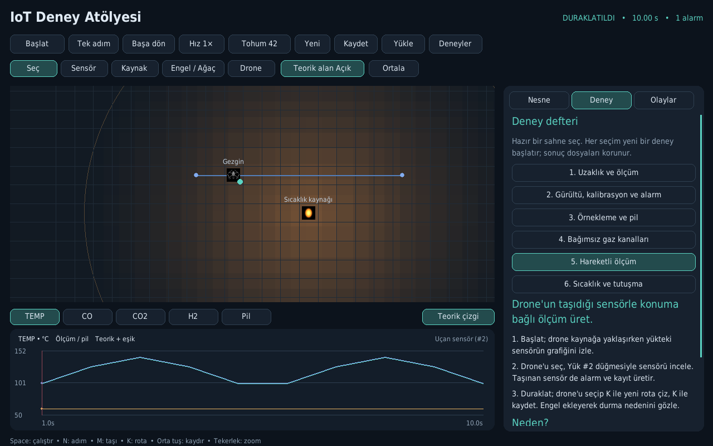

# IoT Deney Atölyesi

Python/Pygame ile çalışan, Türkçe **öğretici sensör ve drone deney ortamı**. Kaynak yerleştir, ölçüm ile teorik değeri karşılaştır, alarm eşiklerini değiştir, pili gözle ve drone ile hareketli ölçüm yap.



## Başla

Python 3.10 veya üzeri gerekir. Güncel doğrulama Python 3.12.3, Pygame 2.6.1 ve Linux üzerinde yapıldı.

```bash
git clone https://github.com/MrSqy/IoT-sensor-grid-simulator.git
cd IoT-sensor-grid-simulator
python3 -m venv .venv
source .venv/bin/activate
python -m pip install -r requirements.txt
python main.py
```

Windows PowerShell'de sanal ortam etkinleştirme: `.venv\Scripts\Activate.ps1`. Windows/macOS üzerinde canlı doğrulama yapılmadı.

Uygulama Uzaklık ve ölçüm deneyiyle açılır. **Başlat**, **Tek adım**, **Başa dön** ve **Deneyler** düğmelerini kullan. Boş sahne için **Yeni**. Bir nesneye tıklayıp sağ panelden özelliklerini değiştir; grafik kanalı düğmeleri hem grafiği hem kanal ayarını seçer.

- **Space:** çalıştır/duraklat; **N:** bir örnekleme adımı.
- **M:** seçili nesneyi taşı; **K:** drone rotası çizmeye başla/bitir; **Esc:** iptal.
- **DEL veya sağ tık:** ortak kuralla sil; drone yükleri boş yakın karelere bırakılır.
- **Tekerlek:** haritada zoom, panelde kaydırma. **Orta tuş sürükle:** haritayı kaydır.
- **Ctrl+S / Ctrl+O:** JSON sahnesi kaydet/yükle.
- Drone seçiliyken **Haritadan yük seç** veya kaynağı/sensörü drone paneline sürükle. Drone bir sensör ya da üç kaynak taşıyabilir.

## Deneyler

1. Uzaklık ve ölçüm
2. Gürültü, kalibrasyon ve alarm
3. Örnekleme ve pil
4. Bağımsız gaz kanalları
5. Drone ile hareketli ölçüm
6. Sıcaklık, maruz kalma süresi ve tutuşma

Her deneyin amacı, adımları ve açıklaması uygulamanın **Deney** sekmesindedir. Ayarları değiştirerek serbest deneyler kurulabilir. Yeni/deney seçimi mevcut sahnenin yerine yeni başlangıç kurar; saklamak istediğin düzeni önce Kaydet ile sakla. Üretilmiş sonuç dosyaları silinmez.

## Sonuçlar ve tekrar üretim

İlk çalıştırma/adımda proje içindeki `exports/` altında benzersiz klasör oluşturulur:

- `experiment.json`: başlangıç sahnesi, tohum, model/sütun sürümü ve birimler.
- `sensor_log.csv`: her sensör örneğinde dört kanal; kapalı/geçersiz değer boş, geçerlilik ayrı sütunda.
- `alarm_log.csv`: alarma giriş/çıkış, durum değişimi ve tutuşma olayları.
- `changes.jsonl`: deney sırasında yapılan düzenlemeler ve simülasyon zamanı.

Kaydet, o andaki düzeni **yeni bir başlangıç sahnesi** olarak saklar; canlı geçmişi ve rastgele üretecin ara durumunu devam ettiren oturum kaydı değildir. Başa dön, deneyin başlangıcını aynı tohumla tekrar kurar. Aynı sahne, tohum ve aynı simülasyon anındaki aynı müdahaleler aynı sonuçları verir.

Pencere açmadan örnek deney:

```bash
python main.py --lesson 5 --seconds 30 --out-dir /tmp/iot-deney
python main.py --scene scenes/deney.json --seed 123 --seconds 10 --out-dir /tmp/iot-deney
```

Sahne şeması 1, model `education-2.0`, sonuç şeması 2'dir. Eski CSV/JSONL dosyaları değiştirilmez. Eski tehdit çokgeni çıkarımı yerine yeni uygulama teorik alan katmanını gösterir; yeni oturumlarda eski çokgen JSONL şeması üretilmez.

## Öğren ve geliştir

- [Ayrıntılı Türkçe proje rehberi](PROJE_REHBERI.md): kurulum, mimari, formüller, kullanıcı akışları ve debug.
- [Bütün dosya, sınıf ve fonksiyonların kaynak rehberi](docs/KOD_REHBERI.md).
- [Doğrulama raporu ve sınırları](docs/DOGRULAMA.md).
- [Onaylı kapsam ve uygulama kaydı](UYGULAMA_PLANI.md).

```bash
python -B -m unittest discover -s tests -v
python -B tools/build_guide.py --check
SDL_VIDEODRIVER=dummy SDL_AUDIODRIVER=dummy python -B tools/verify_runtime.py --output /tmp/iot-dogrulama
```

Bu uygulama basit eğitim modelleri kullanır. Teorik alan sensörün çevreyi gerçekten taradığı anlamına gelmez. Eşikler eğitim ayarlarıdır; iş güvenliği, gerçek gaz maruziyeti veya yangın tahmini için doğrulanmış sınırlar değildir. Gerçek cihaz/MQTT bağlantısı bulunmaz.

`IoT PyGame/` eski/alternatif sürümdür; kaynakları ve ikonları korunmuştur. Güncel giriş `main.py` dosyasıdır. `CALCULATOR.py` bağımsız sınıf/olay örneğini de içerir; güncel uygulama onun saat enjekte edilebilen kota sınıfını kullanır.

## Sahne sınırları

Bir sahne en fazla 500 nesne, drone başına 500 durak ve UTF-8 JSON olarak 2 MB içerebilir. Sınırı aşan düzenleme reddedilir; çok büyük sahne kaydedilirken mevcut dosya korunur. Düzenleme deneyi duraklatır. Sensör/kanal kapatıldığında grafik ve CSV'de ölçüm yokluğu açıkça kaydedilir.

## Katkı ve lisans

Projenin fikri, konsepti ve tasarım sahipliği **Baran Demir B.**'ye aittir. İlk sürümde Anthropic Claude Opus 4.6 ile kod desteği alınmıştır. Bu sürüm kullanıcı tarafından onaylanan öğretici deney kapsamı doğrultusunda geliştirilmiştir.

[MIT lisansı](LICENSE).
