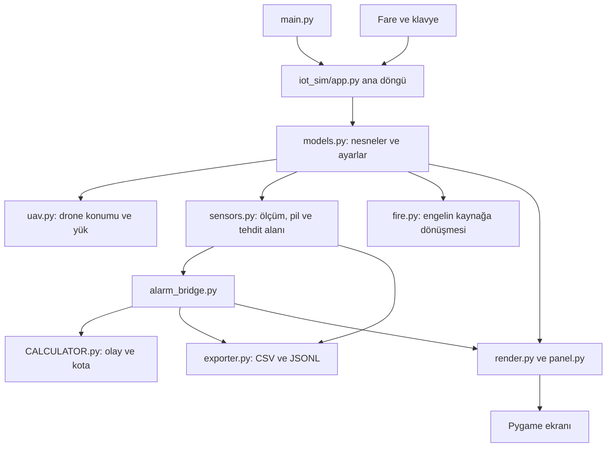

# IoT Grid Simulator — inceleme, onaylı kapsam ve teslim kaydı

**Durum: Kullanıcı 21 Eylül 2026 tarihinde P01–P09 paketinin tamamını onayladı ve uygulamayı başlattı. Paketin uygulaması ve yerel doğrulaması tamamlandı; sonuçlar bölüm 8 ve docs/DOGRULAMA.md içinde.**

Bu dosya inceleme ve ortak karar geçmişini korur. **Bölüm 2–5 başlangıç commitine ait tarihsel incelemedir; güncel uygulama veya son test sonucu olarak okunmamalıdır.** Bölüm 6–7 onaylanan paketi, bölüm 8 teslimi anlatır. Uygulama yetkisi kullanıcının açık onayından gelir. İlk teslimden sonraki kullanıcı talimatıyla yerel commit yetkisi verildi; push yetkisi verilmedi.

## 1. İncelenen sürüm ve yetkilendirilmiş kapsam

- Tarih: 21 Eylül 2026.
- Repo: `https://github.com/MrSqy/IoT-sensor-grid-simulator.git`.
- Yerel klasör: `/home/baranbeey/Masaüstü/git_analiz/IoT-sensor-grid-simulator`.
- Dal: `main`.
- Commit: `333d0ae31d2cd950d8f40dc3fa4506182278e89b` (`Update README.md`).
- Başlangıç durumu: Git tarafından izlenen dosyalarda değişiklik yok; yerel `AGENTS.md` izlenmeyen dosya olarak mevcut. Korundu.
- Başlangıçta `UYGULAMA_PLANI.md` ve `PROJE_REHBERI.md` yoktu.
- Kullanıcının açık talimatı: başlanmamış bir proje seç, durum dosyasında İŞLENEN yap, repo talimatlarını oku, önce nasıl çalıştığını ve önerileri sun; bütün uygulama kararlarını birlikte konuş.
- `../PROJE_DURUMLARI.txt` içinde yalnız bu proje BAŞLANMAYAN bölümünden İŞLENEN bölümüne taşındı.
- İlk inceleme aşamasında ürün kodu, bağımlılıklar, README ve repo içi test dosyaları değiştirilmedi. Commit/push yapılmadı.
- Uygulama için kabul edilmiş kapsam: **P01–P09 paketinin tamamı**, aşağıdaki tasarım tercihleri ve kabul senaryolarıyla birlikte.
- Kullanıcının sonraki kararı: proje **öğretici bir deney ortamı** olmalı; bu amaçla kapsam genişleyebilir. Öneriler ayrı ayrı karar sorularına bölünmeden, birlikte değerlendirilebilecek tek paket halinde sunulmalı. Bu kapsam mesajının ardından kullanıcı ayrıca “Onaylıyorum. Uygulamaya geçebilirsin.” diyerek paketi başlattı.

Kök `AGENTS.md` hazırlık merkezi kapsamını anlatıyor. Kullanıcının bu görevdeki açık talimatı doğrultusunda yalnız seçilen repo incelendi; toplu repo analizi, ayrı görev açma veya model değiştirme yapılmadı.

## 2. Proje inceleme başlangıcında ne yapıyordu?

Bu bir yerel masaüstü simülasyonu. Python uygulama mantığını, Pygame pencereyi, fare/klavye olaylarını ve çizimi sağlıyor. Gerçek sensörden veri alma veya drone donanımına komut gönderme bağlantısı mevcut değil.

Kullanıcı 200 × 200 karelik haritaya sensör, sıcaklık/gaz kaynağı, engel/ağaç, yanık kaynak ve drone koyabiliyor. Bir kare kaynakta `tile` olarak adlandırılıyor; metreye karşılığı tanımlanmamış. Sağ panelden ölçüm kanalları ve sayısal ayarlar değiştiriliyor. Space ile simülasyon başlatılıp durduruluyor.

Bir sensör dört ayrı kanalı izleyebiliyor: sıcaklık, CO, CO₂ ve H₂. Gaz değerleri ppm biriminde gösteriliyor; ppm, bir milyon birim karışım içindeki ilgili gaz miktarını ifade eder. Gaz kaynağında hiçbir gaz seçilmezse katkı sıfırdır.

Drone rotası, sırayla ziyaret edilen harita noktalarından oluşuyor. LOOP son noktadan ilk noktaya dönüyor; PINGPONG aynı yolu ters yönde takip ediyor. Drone bir sensör **veya** en fazla üç kaynak taşıyabiliyor; sensör ve kaynak birlikte taşınamıyor.

Uygulama açılışta boş bir sahne oluşturuyor. Ölçüm sonuçlarını CSV ve tehdit çokgenlerini JSONL olarak dışa aktarıyor. CSV tablo satırları içerir; JSONL dosyasında her satır ayrı bir veri kaydıdır. Bunlar sahneyi yeniden açmaya yarayan kayıt dosyaları değildir. Senaryo kaydetme/yükleme akışı mevcut kaynakta bulunmadı.

### Kullanıcı eyleminden sonuca veri akışı



Örnek: kullanıcı sıcaklık kaynağı eklediğinde `app.py`, `SourceProps` taşıyan bir `Entity` oluşturur. `Entity`, haritadaki nesnenin kimliğini, türünü ve konumunu tutan kayıttır. Simülasyon çalışırken her bir simülasyon saniyesinde `simulate_tick` kaynakların sensöre katkısını toplar, pil tüketimini çıkarır ve ölçüme rastgele sapma ekler. `AlarmBridge`, ölçümleri olay motoruna aktarır; ayrıca panel için kendi eşik karşılaştırmasını yapar. Bu iki değerlendirme bugün birbirinden farklıdır (B01). Sonuçlar dosyaya yazılır ve ekran yeniden çizilir.

### Zaman ve modelin mevcut anlamı

- Ekran hedefi 60 kare/saniye; sensör hesaplama adımı 1 simülasyon saniyesi (`constants.py:5,11`). Hesaplama adımına kodda `tick` deniyor.
- Drone hareketi her karede, geçen süreye göre hesaplanıyor (`app.py:128`, `uav.py:17`).
- Yangın yayılımı her 2 simülasyon saniyesinde deneniyor (`app.py:152-155`).
- Sıcaklık katkısı mesafe/menzil oranının 1,5 kuvvetiyle, gaz katkısı 1,3 kuvvetiyle azalıyor (`sensors.py:38-80`). Kaynak etkisi anında hesaplanıyor; zaman içinde biriken bir gaz alanı, rüzgâr, havalandırma veya ısı denklemi çözümü bulunmuyor.
- Mesafeye göre ayrıca bir doğruluk tablosu ve ölçümlere ±%5 rastgele sapma uygulanıyor. Sabit rastgelelik tohumu için kullanıcı ayarı yok. Tohum, aynı deneyde aynı rastgele sayı dizisini tekrar üretmeye yarar.
- Pil tüketimi `menzil² × (1 + (100 − verimlilik)/100) × süre`. Kanal sayısı bu formülde yok; bütün kanallar kapalıyken de pil tüketiliyor.
- Alarm kotası simülasyon saatini değil bilgisayarın gerçek saatini kullanıyor (`CALCULATOR.py:47-57`).
- Tehdit çokgeni, sensörden çıkan 16 yönde örnekleme ile yaklaşık alan çıkarıyor; bilimsel olarak doğrulanmış tehlike sınırı değildir. Güncel çizici bu çokgeni doğrudan çizmiyor; JSONL dışa aktarımı kullanıyor.
- README'deki fiziksel doğruluk ve gerçek dünya eşiklerine ilişkin iddialar bu incelemede bilimsel/mevzuatsal olarak doğrulanmadı. Kodun kullandığı eşikler yazılım davranışını açıklamak içindir.

## 3. Kaynak haritası ve bakım durumu

Git'te 39 dosya izleniyor: 23 Python dosyası, 12 PNG, README, lisans, `.gitignore` ve `requirements.txt`. Yerel `AGENTS.md` ve bu plan bu sayıya dahil değil.

| Dosya veya grup | Görev ve ilişki |
|---|---|
| `main.py` | Belgelenen güncel giriş noktası; `iot_sim.app.main` çağırıyor. |
| `iot_sim/app.py` | Başlatma, ortak durum, girdi işleme, güncelleme sırası ve dosya kapatma; yaklaşık 615 satırlık ana modül. |
| `iot_sim/models.py` | Nesne türleri, sensör/kaynak/drone özellikleri, alarm eşikleri. |
| `iot_sim/sensors.py` | Kaynak katkısı, sensör ölçümü, pil ve tehdit çokgeni. |
| `iot_sim/alarm_bridge.py` | Simülasyon ölçümlerini CALCULATOR nesnelerine dönüştürüyor; sensör başına kota ve panel durumunu yönetiyor. |
| `CALCULATOR.py` | Sensör doğrulama/kalibrasyon, olay motoru, kota, sınırlı bellek kaydı ve konsol bildirimi. Ayrıca bağımsız bir örnek çalıştırma bloğu var; otomatik test paketi değil. |
| `iot_sim/uav.py` | LOOP/PINGPONG hareketi ve rota izleyen drone'un yük konumunu güncelleme. |
| `iot_sim/cargo.py` | Yük kapasitesi/tür uyumluluğu ve drone'a bağlama. Silme/ayırma işlemleri ayrıca app ve panel içinde dağılmış. |
| `iot_sim/fire.py` | Yakındaki sıcaklık kaynağına göre ağacı/engeli sıcaklık kaynağına dönüştürme. |
| `iot_sim/engine.py` | Nesne arama, sınırlandırma, doğruluk tablosu ve rota segmentlerinin engel kontrolü. |
| `iot_sim/camera.py` | Harita-ekran koordinat dönüşümü, zoom sınırı. |
| `iot_sim/render.py` | Harita, ikonlar, etki çemberleri, rota çizgileri ve alarm çerçeveleri. |
| `iot_sim/panel.py` | Kontrolleri ve tıklama işlemlerini kurma, sensör/kaynak/drone/log panelini çizme; yaklaşık 791 satır. |
| `iot_sim/ui_widgets.py` | Buton, anahtar ve seçenek bileşenlerinin çizimi. |
| `iot_sim/viz.py` | Kaynak etki görseli üretme ve önbelleğe alma; kesikli çember yardımcısı. |
| `iot_sim/assets.py` | İkon okuma ve boyutlandırma; okuma hatası sessizce `None` oluyor. |
| `iot_sim/exporter.py` | Ölçüm CSV, alarm CSV ve çokgen JSONL dosyalarını açma/yazma/kapatma. |
| `iot_sim/geom.py` | Çokgen sıralama/alan yardımcıları. Güncel sensör modülünde ayrı alan hesabı bulunuyor; bu modüle güncel akışta çağrı bulunmadı. |
| `iot_sim/__init__.py`, `iot_sim/IoT.py` | Paket içinden bazı isimleri yeniden sunuyor. `IoT.py` ayrı bir uygulama başlangıcı değil. |
| `assets/*.png` | `sensor`, `source_temp`, `source_gas`, `obstacle`, `burned`, `drone` için altı ikon. |
| `IoT PyGame/iot_sim/main.py` | Ayrı, 1730 satırlık eski/alternatif tek dosyalı uygulama; güncel giriş noktası bunu çağırmıyor. |
| `IoT PyGame/iot_sim/.main_yedek.py` | Git'te izlenen 1706 satırlık gizli yedek kaynak; korunmalı. |
| `IoT PyGame/iot_sim/assets/*.png` | Alternatif sürümün altı ikonu. Güncel ikonlarla tamamı birebir aynı değil; topluca kopya kabul edilip silinmemeli. |
| `requirements.txt` | Yalnız `pygame>=2.5.0`; yeniden üretilebilir bir sürüm kilidi yok. |
| `.gitignore` | Python önbellekleri, sanal ortamlar, üretilen CSV/JSONL ve dağıtım çıktıları hariç tutuluyor. |
| `README.md`, `LICENSE` | Kurulum/kullanım özeti ve MIT lisansı. README'deki clone adresi mevcut `origin` ile farklı isim kullanıyor. |

Mevcut test klasörü, pytest/unittest paketi veya CI iş akışı bulunmadı. Son iki commit ilk yükleme ve README güncellemesinden oluşuyor; geçmişte temizlik yapılmadı. Alternatif sürümlerde envanter, giriş noktası ayrımı ve sözdizimi kontrolü yapıldı; bunların bütün kullanıcı akışları ayrıca çalıştırılmadı.

## 4. Öncelikli bulgular

### B01 — Aynı ölçüm için birbiriyle çelişen alarm sonuçları

**Kanıt düzeyi:** Mevcut fonksiyonlar çalıştırılarak doğrulandı. **Öncelik:** Yüksek.

`alarm_bridge.py:249-256`, `EventEngine` oluştururken eşik vermiyor. `CALCULATOR.py:226,274` bütün kanalları varsayılan `80` değeriyle ve `>` karşılaştırmasıyla değerlendiriyor. Panel durumu ise `alarm_bridge.py:272-293` içinde kanal bazlı eşikler ve `>=` kullanıyor.

| Girdi | Panel durumu | Bellekteki olay |
|---|---|---|
| TEMP = 70°C | ALERT | CALM |
| CO = 50 ppm | ALERT | CALM |
| CO₂ = 100 ppm | CALM | ALERT |
| H₂ = 100 ppm | CALM | ALERT |

Alarm CSV'si panelin kullandığı `active_alerts` üzerinden yazılıyor (`app.py:145-150`); konsol/olay geçmişi öteki motoru kullanıyor. Böylece gösterimler ve kayıtlar tek bir gerçeği paylaşmıyor.

**Çözüm yönü:** Kanal bazında ortak bir değerlendirme sonucu üretmek ve panel, bildirim, olay geçmişi ile CSV'yi bu sonucun tüketicileri yapmak. **Fayda:** Aynı ölçüm her yerde aynı anlama gelir. **Risk/karar:** Eşikte eşitlik, tekrar bildirim sıklığı ve kotanın rolü konuşulmadan yalnız sayısal eşik değiştirilmemeli. **Kabul:** Her kanal için eşik altı/eşit/üstü durumlarında bütün çıktılar aynı sonucu göstermeli.

### B02 — Tek noktayı tekrarlayan rota uygulamayı kilitliyor

**Kanıt düzeyi:** Ayrı süreçte 1 saniyelik zaman aşımıyla tekrar üretildi. **Öncelik:** Yüksek.

`uav.py:19-47` hedefe zaten ulaşılmışken sadece hedef indeksini değiştiriyor; kalan hareket mesafesi azalmıyor. Bütün duraklar aynıysa döngü hiç sonlanmıyor. `app.py:468` aynı koordinatın tekrar eklenmesini engellemiyor.

**Tekrar:** Drone rotasını `[(2,2),(2,2)]`, konumunu `(2,2)` yapıp `update_uavs(...,0.016,200,200)` çağır. Çağrı geri dönmedi. Arayüz karşılığı: K ile düzenlemeye gir, aynı kareye iki kez tıkla, K ile bitir, simülasyonu başlat. Bu arayüz sırası kaynakla eşleştirildi; dondurma denemesi ayrı süreçte doğrudan hareket fonksiyonunda yapıldı.

**Çözüm yönü:** Rota girişinde farklı durak doğrulaması ve hareket döngüsünde ilerleme güvencesi. **Fayda:** Hatalı rota pencereyi kilitlemez. **Risk:** Aynı noktada bekleme özelliği istenirse bunun açık süre alanıyla tasarlanması gerekir. **Kabul:** Boş, tek durak, aynı duraklar, ardışık tekrarlar, LOOP/PINGPONG testleri sonlu sürede dönmeli; geçerli hareket korunmalı.

### B03 — Drone silme ve taşıma işlemleri yük bağlantısını bozuyor

**Kanıt düzeyi:** Gerçek `app.main` döngüsünde kontrollü fare/klavye olaylarıyla doğrulandı. **Öncelik:** Yüksek.

- DEL yolu yüklerin `carried_by` alanını temizliyor (`app.py:249-255`). Sağ tık yolu doğrudan nesneyi listeden çıkarıyor (`app.py:351-360`). Sağ tıkla drone silindikten sonra sensörün `carried_by=1` değeri kaldı; artık #1 drone mevcut değildi. Çizici bağlı nesneleri gizlediği için yük görünmez kalabilir; alarm ve CSV akışından da çıkar.
- M ile rotasız drone'u `(99,99)` konumundan `(109,99)` konumuna taşıma denemesinde yük `(99,99)` konumunda kaldı (`app.py:452-459`). Yük eşitlemesi `uav.py:64-70` içinde, rotasız drone'u atlayan koşulun arkasında (`uav.py:13-14`).

**Çözüm yönü:** Silme, taşıma ve yük ayırma kurallarını ortak işlemlerde toplamak; kimlik bağlantılarını her yoldan tutarlı güncellemek. **Fayda:** Fare ve klavye aynı işi yapar; yük fiziksel olarak drone'la kalır. **Risk/karar:** Drone silinince yük yere mi bırakılmalı, onunla birlikte mi kaldırılmalı? Mevcut DEL davranışını korumak en küçük değişiklik olur; kullanıcı kararı bekleniyor. **Kabul:** Her silme girişinde sahnede olmayan bir drone'a bağlı nesne kalmamalı; duraklatılmış/rotasız drone taşınırken yük konumu da güncellenmeli.

### B04 — LOOP rotasının dönüş parçası engel kontrolünden geçmiyor

**Kanıt düzeyi:** Rota doğrulama ve hareket fonksiyonlarıyla tekrar üretildi. **Öncelik:** Yüksek.

`engine.py:68-81` yalnız listedeki ardışık noktaları kontrol ediyor. LOOP modundaki son → ilk parçası ve drone'un mevcut konumundan ilk durağa gidişi bu kontrolde yok. Hareket sırasında ayrıca engel kontrolü bulunmuyor.

**Tekrar:** `[(2,2),(2,4),(4,4)]` rotası, `(3,3)` engeli varken geçerli kabul edildi. Drone dönüşte `(3,3)` konumuna ulaştı.

**Çözüm yönü:** Rota türüne ve başlangıç konumuna göre gerçekten uçulacak tüm parçaları doğrulamak. **Risk/karar:** Rota kaydedildikten sonra yeni engel eklenince durmak, rotayı geçersiz göstermek veya yeniden rota istemek seçeneklerinden biri belirlenmeli. **Kabul:** Başlangıç, ara parçalar, dönüş ve sonradan eklenen engel ayrı senaryolarla sınanmalı.

### B05 — Kota davranışı ölçüm, olay ve saat açısından parçalı

**Kanıt düzeyi:** Fonksiyon çağrıları ve kaynak incelemesiyle doğrulandı. **Öncelik:** Yüksek; ürün kararı gerektiriyor.

- Varsayılan 40 hak ve dört kanal ile 10 hesaplama adımında hak bitiyor. Sonraki adımlarda olay motoru kayıt üretmiyor; ölçümler, panelin alarm değerlendirmesi ve CSV alarm yazımı sürüyor.
- `AlarmBridge.update(..., sim_time=120)` çağrısı kotayı yenilemedi; gerçek 60 saniye beklenmesi gerekiyor. `sim_time` bu sınıfta karar için kullanılmıyor.
- Kullanıcı ilk ölçümden önce kalan limiti 0 yaparsa ilk değerlendirme bunu uygulamıyor; tek kanallı denemede kalan hak 39 oldu (`alarm_bridge.py:140-155`).
- Her adımda yeni `EventEngine` oluşturulduğu için 5 saniyelik mesaj bekleme bilgisi kayboluyor. Arka arkaya yapılan dört kotasız değerlendirmede dört uyarı üretildi.

**Çözüm yönü:** Kotanın neyi sınırladığını seçmek; saat kaynağını açıkça belirlemek; kalıcı sensör durumu ve ilk senkronizasyonu düzeltmek. **Fayda:** Sonuçlar duraklatma ve işlem hızından beklenmedik şekilde etkilenmez. **Risk:** Mevcut CALCULATOR örneğinin eğitim amacı ve dış kullanımı korunmalı. **Kabul:** İlk panel ayarı, tam sınırda yenileme, duraklatma, kanal değiştirme ve art arda kotasız adımlar doğrulanmalı.

### B06 — Pil bitmiş sensör CALM; taşınan sensör ölçüyor ama alarm üretmiyor

**Kanıt düzeyi:** Çalıştırılarak doğrulandı. **Öncelik:** Yüksek/orta; davranış kararı gerektiriyor.

`sensors.py:235-260` pil bitince ölçümleri sıfırlıyor ve `active=False` yapıyor. `AlarmBridge` aktiflik kontrolü yapmadığı için aynı sensör için CALM olayı kaydedip hak tüketiyor. Denemede pil=0, aktif=false, durum=CALM, olay sayısı=1 oldu. Veri yokluğu kullanıcıya normal ortam ölçümü gibi görünebilir.

Taşınan sensör ölçüm ve pil tüketimine devam ediyor; fakat `alarm_bridge.py:205-210` ve `app.py:142` bu sensörü alarm ve ölçüm CSV'sinden dışlıyor. Denemede yaklaşık 247,26°C okuyan taşınan sensörün alarm durumu N/A, olay sayısı 0 idi.

**Çözüm yönü:** Ölçülemiyor/kapalı/taşınıyor/normal/alarm durumlarını ve taşınma sırasında çalışma kuralını tanımlamak. **Fayda:** Veri eksikliği normal ölçümle karışmaz. **Risk:** CSV tüketen araçlarda yeni durum alanı veya boş değer desteği gerekebilir. **Kabul:** Pilin tükenmesi/doldurulması, tüm modların kapatılması, drone'a bindirme/indirme boyunca panel ve kayıtlar aynı kurala uymalı.

### B07 — Dışa aktarım dosya adı çakışması önceki veriyi silebilir

**Kanıt düzeyi:** Geçici klasörde gerçek dosya yazımıyla doğrulandı. **Öncelik:** Orta.

`exporter.py:7-8` dosya adında saniye çözünürlüğü kullanıyor; `20,31,33` satırlarında dosyalar `w` moduyla açılıyor. Aynı saniye etiketiyle ikinci exporter oluşturulduğunda birinci oturumun yazdığı veri satırı kayboldu. Aynı çıkış klasörüne eşzamanlı açılışlar risklidir.

Ek olarak `app.py:25,31` aynı açılışta iki kez exporter kuruyor; kontrollü uygulama akışlarında bu iki çağrı doğrulandı. Bu tek başına gerçek ölçüm kaybı kanıtı değildir; ölçümler daha sonra başlıyor. Kapanış yalnız normal döngü çıkışında; beklenmedik hata durumuna ilişkin `finally` yok.

**Çözüm yönü:** Tek exporter, çakışmayan oturum kimliği, var olan dosyayı ezmeyen oluşturma ve güvenli kapatma. **Risk/karar:** Dosya adı kullanan dış betikler varsa uyumluluk gözetilmeli. **Kabul:** Aynı saniyede iki oturumun verisi ayrı kalmalı; hata enjeksiyonunda dosyalar kapanmalı; normal CSV/JSONL şeması kararlaştırılmış şekilde korunmalı.

### B08 — Paneldeki fizik terimleri mevcut hesaplarla örtüşmüyor

**Kanıt düzeyi:** Ölçüm denemeleri ve kaynak incelemesiyle doğrulandı. **Öncelik:** Orta; doğru davranış ürün amacına bağlı.

- Sensörün menzilini 1'den 10'a yükseltmek, 5 kare uzaktaki aynı kaynak için ölçümü değiştirmedi: her ikisi yaklaşık 198,64°C. Pil tüketimi ve tehdit alanı hesabı değişiyor. `sensors.py:278-303` ölçümü sensör menziliyle doğrudan sınırlamıyor.
- Sensör menzili 50, kaynak menzili 80 olsa da 16 kare uzaktaki kaynağın katkısı sıfır; doğruluk tablosu 15 mesafesinde bitiyor (`constants.py:13`, `engine.py:11-16`).
- Kaynak “Güç” değerini 1'den 10'a değiştirmek ölçümü değiştirmedi. Güncel ölçüm formülleri bunu kullanmıyor; `render.py:117,150` yalnız görselin saydamlığını değiştiriyor.
- 50°C kaynak ve bir kare ötedeki ağaçla yangın adımında ağaç 300°C kaynağa dönüştü. `fire.py:30-44` sıcaklık yerine yalnız mesafeyle tutuşma olasılığı hesaplıyor.

**Çözüm yönü:** Önce noktasal ölçüm mü, alan tarama oyunu mu istediğimizi seçmek; sonra menzil, doğruluk ve güç terimlerini buna uydurmak. Yangın için eğitim amaçlı sade kural da mümkündür; fiziksel olarak doğrulanmış model iddiasıyla karıştırılmamalı. **Fayda:** Kullanıcı yaptığı ayarın neyi değiştirdiğini öngörebilir. **Risk:** Sonuçları en fazla değiştirecek bölüm budur; hata düzeltmelerine gizlice eklenmemeli. **Kabul:** Seçilen model için mesafe/menzil/güç/sıcaklık örnekleri ve birim açıklamaları birlikte yazılmalı.

### B09 — İzin verilen görsel ayarlar çok büyük bellek ayırımı isteyebilir

**Kanıt düzeyi:** Statik boyut hesabı; uç durumda bellek ayırımı çalıştırılmadı. **Öncelik:** Orta/yüksek risk.

Panel kaynak menzilini 80'e, kamera zoom'u 4'e çıkarabiliyor. `render.py:114,146` ve `viz.py:42-43` birleşince bir kaynak efekti için kenarı 10.241 piksel olan yüzey isteniyor. Piksel başına 4 bayt varsayımıyla yaklaşık **400 MiB** ham piksel belleği; üç gaz için yaklaşık 1,17 GiB olur. Önceki boyut/güç anahtarları önbellekte kalabildiğinden toplam daha fazla olabilir.

**Çözüm yönü:** Ekrandaki görünür alanla sınırlı çizim, düşük çözünürlüklü efektin ölçeklenmesi, nesne kimliğinden bağımsız ortak önbellek ve bellek sınırı seçeneklerini değerlendirmek. **Fayda:** Ayar büyütmek uygulamayı bellek baskısına sokmaz. **Risk:** Efekt görünümü değişebilir; görsel karşılaştırma gerekir. **Kabul:** Onaylanan üst sınır senaryosunda bellek ve kare süresi ölçülmeli; bu aşamada performans başarısı iddia edilmiyor.

### B10 — Arayüzde okunurluk sorunları

**Kanıt düzeyi:** Pygame ile üretilmiş ekran görüntüsü incelendi. **Öncelik:** Orta.

1200 × 800 görüntüde sağ panelin alarm özeti “Görünüm” başlığına çok yakın/üst üste geliyor (`panel.py:652-657`). Son olay metinleri panelin sağ sınırında kesiliyor (`panel.py:726-732`). Sabit 320 piksel panel, uzun adlar ve çok kanallı uyarıları satıra bölmüyor. Panelin tamamı kaydığı için alt özelliklere inerken araçlar ve durum bilgileri de görünümden çıkıyor.

**Çözüm yönü:** Bölüm aralıkları, metin sarma ve alarm/ölçüm bilgisinin önceliğini düzenlemek; sabit üst durum alanını değerlendirmek. **Fayda:** Kullanıcı alarmın tam nedenini okuyabilir. **Risk:** Tıklama koordinatları ve kaydırma hesabı çizimle birlikte güncellenmeli. **Kabul:** Uzun Türkçe ad, dört kanallı alarm, yük paneli ve logda metin kesilmemesi; gerçek masaüstünde fare/klavye doğrulaması.

### B11 — Tekrar üretilebilirlik, başlangıç ve dokümantasyon boşlukları

**Kanıt düzeyi:** Kaynak/envanter incelemesi. **Öncelik:** Orta/düşük; çoğu ürün önerisi.

- Sahne kaydetme/yükleme, deney tohumu, tek adımla ilerleme ve ayarların dışa aktarımı yok. Bunlar mevcut özellikte hata değil, ek ürün kapsamıdır.
- İkonlar ve exports yolu çalışma dizinine göre çözülüyor (`app.py:25,31,98-103`). Başka dizinden mutlak `main.py` yolu ile başlatmak ikonları sessizce kaybettirebilir; paket köküne göre çözüm önerilir.
- README clone komutunun repo adı `origin` ile farklı. Uzak adrese erişip yönlendirme kontrolü yapılmadı; kesin “404” iddiası yok.
- `pygame>=2.5.0` gelecekte farklı sürümler seçebilir. Temiz kurulum ve desteklenen Python/Pygame aralığı ayrıca doğrulanmalı.
- Eski sürümler ile güncel sürümün rolü belgelenmeli; silme kararı alınmadı.
- Ayrıntılı Türkçe rehber mevcut değil. `AGENTS.md` gereği uygulama sonunda son kodu anlatan `PROJE_REHBERI.md` hazırlanıp README'den bağlanmalı. Bu plan nihai rehberin yerine geçmiyor.

## 5. Gerçekte çalıştırılan kontroller

Deneme betikleri ve çıktıları yalnız `/tmp/iot-audit-20260921-qGIssI/` altında üretildi. Repo içindeki kullanıcının CSV/JSONL sonuçlarına yazılmadı. Python `-B` kullanıldı; kaynakta bytecode önbelleği oluşturulmadı.

| Kontrol | Sonuç ve sınırı |
|---|---|
| 23 Python dosyasını `ast.parse` ile çözümleme | Başarılı. Sözdizimini doğrular, çalışma doğruluğunu değil. Eski/gizli yedek dosyalar dahil. |
| Alarm eşikleri | B01'deki dört çelişki tekrar üretildi. |
| Kota, ilk ayar, pil bitimi, taşınan sensör | B05/B06 sonuçları tekrar üretildi. Gerçek 60 saniyelik bekleme testi yapılmadı. |
| Menzil/güç karşılaştırması | Rastgele ölçüm sapması deneme içinde sıfırlanarak B08 sonuçları ölçüldü. Ürün kaynakları değiştirilmedi. |
| Yinelenen drone durakları | Ayrı süreç 1 saniyede dönmedi; deneme süreci zaman aşımıyla durduruldu. Kaynakta ilerlemeyen döngü görüldü. |
| LOOP dönüşü | Geçerli kabul edilen rotada drone engel koordinatına ulaştı. |
| Normal drone hareketi | Tek 3 saniyelik adım ve 30 × 0,1 saniyelik adım aynı konumu üretti (kayan nokta toleransıyla). Bu, bütün uygulamanın kare hızından bağımsız olduğunu kanıtlamaz. |
| Normal exporter | Bir sensör CSV satırı, bir alarm CSV satırı ve bir JSONL çokgen kaydı okunabildi. |
| Aynı zaman etiketiyle exporter | Önceki veri satırının silinmesi tekrar üretildi. |
| Gerçek Pygame uygulama döngüsü | `SDL_VIDEODRIVER=dummy` ile 11 karelik kontrollü akış: sensör/kaynak ekleme, sensör seçme, başlatma, log görünümü, çıkış. 4 simülasyon saniyesi, 16 motor olayı; 4 sensör CSV, 4 alarm CSV ve 4 çokgen kaydı. |
| Silme/taşıma girdi yolları | Yüklü drone başlangıç verisiyle sağ tık, DEL ve M üzerinden gerçek olay işleyici çalıştırıldı; B03 doğrulandı. |
| Görsel inceleme | Uygulamanın ürettiği `app-smoke/frame-9.png` incelendi; B10 görüldü. |
| İzlenen kaynakların SHA-256 karşılaştırması | Denemeler sonrasında 39 izlenen dosyanın içeriği değişmemişti. |

Ortam: Python 3.12.3. Sistem Python'unda Pygame yoktu. Grafik denemeleri makinede mevcut `/tmp/cloneempires-audit-env/bin/python` ve Pygame 2.6.1 / SDL 2.28.4 ile yapıldı; bu ortama paket kurulmadı veya ortam değiştirilmedi. Bu kanıt temiz kurulum testi değildir.

Tekrar çalıştırma (geçici dosyalar mevcut olduğu sürece):

```bash
python3 -B /tmp/iot-audit-20260921-qGIssI/audit_core.py
/tmp/cloneempires-audit-env/bin/python -B /tmp/iot-audit-20260921-qGIssI/audit_ui.py
```

Sonuçlar: `core_results.json`, `ui_results.json`; ekranlar `app-smoke/frame-0.png`, `frame-7.png`, `frame-9.png`. `/tmp` kalıcı arşiv sayılmaz; önemli sayısal bulgular ve tekrar üretme girdileri bu plana taşındı. Bunlar repo için kurulmuş ve sürekli geçen bir test paketi değildir; mevcut sorunları araştıran geçici denemelerdir.

**Henüz doğrulanmadı:** Gerçek masaüstünde insanın fare/klavye kullanımı; Windows/macOS; temiz sanal ortam kurulumu; uzun süreli veya büyük sahne performansı; uç bellek ayarı; gerçek sensör/drone donanımı; bilimsel yayılım/yangın modeli; README'deki mesleki maruziyet eşiklerinin mevzuat kaynakları. Eski iki uygulama uçtan uca çalıştırılmadı.

## 6. Kabul edilen hedef ve toplu tasarım önerisi

D01 kullanıcı tarafından kabul edildi: **öğretici deney ortamı**. Kullanıcı kapsamın büyüyebileceğini, önerileri topluca değerlendirmek istediğini belirtti. D02-D09 aşağıdaki tercihlerle tek paket halinde sunuldu ve sonraki açık uygulama onayıyla kabul edildi. Tablodaki öneriler karar geçmişini, bölüm 8 ise gerçekleşen sonucu gösterir.

| Karar | Seçenekler ve etkileri | İlk öneri / durum |
|---|---|---|
| D01 — Projenin amacı | Öğretici deney ortamı; amaca hizmet eden kapsam artışı mümkün. | **Kabul edildi.** |
| D02 — Kotanın rolü ve saati | Ölçüm, alarm kararı, olay kaydı ve kullanıcı bildirimi farklı işlerdir. | **Öneri:** Kota yalnız tekrarlı kullanıcı bildirimini sınırlasın; ölçüm, olay geçişleri ve görünür alarm durumu kaybolmasın. Deneyle ilgili bütün süreler simülasyon saatini kullansın. |
| D03 — Sensörün anlamı | Noktasal ölçüm ile çevre alanını bilmek farklıdır. | **Öneri:** Sensör bulunduğu noktayı ölçsün. Çevredeki teorik alanı gösteren ayrı öğretici katman, simülatörün bildiği alan olarak etiketlensin. Sensörün gerçekte bütün çevreyi ölçtüğü izlenimi verilmesin. |
| D04 — Taşınan ve enerjisiz sensör | Hareket, enerji ve ölçüm geçerliliği birlikte ele alınmalı. | **Öneri:** Drone üzerindeki sensör çalışsın ve kayıt üretsin; pil bitince açıkça ölçülemiyor durumuna geçsin. Drone silinince yük geçerli yakın karelere bırakılsın; yer yoksa işlem gerekçesiyle reddedilsin. |
| D05 — Alarmın yaşam döngüsü | Ölçüm örneği, alarma giriş/çıkış olayı ve bildirim tekrarını ayırmak gerekir. | **Öneri:** Ölçümler her örneklemede, alarm olayları durum değişiminde kaydedilsin. Ayarlanabilir giriş/çıkış eşikleriyle eşik çevresindeki titreşim azaltılsın; tekrar bildirimi varsayılan kapalı olsun. |
| D06 — Kaynak gücü, yangın ve engel | Terimler hesaplanan etkiyle eşleşmeli. | **Öneri:** Kaynak şiddetini °C/ppm ve yayılım yarıçapı belirlesin; mevcut görsel güç ayarı görünürlük adıyla ayrı tutulabilsin. Yangın sıcaklık ve maruz kalma süresiyle açıklanabilir bir eğitim kuralı kullansın. Engelin yanabilirliği ayrı özellik olsun; gaz/ısı duvar etkileşimi ilk pakette olmasın. |
| D07 — Senaryo ve deney araçları | Deneyi tekrar kurma, gözlemleme ve açıklama. | **Öneri:** Sahne kaydet/yükle, başlangıca dön, sabit tohum, tek adım, hız seçimi, ölçüm grafikleri, örnek deneyler ve sonuçlarla birlikte deney ayarlarını saklama. |
| D08 — Eski sürümler | Eski uygulamalar güncel girişten ayrıştırılmalı. | **Öneri:** Dosyaları koru, eski/alternatif sürüm olarak belgeleyip güncel giriş noktasını açıkça göster. |
| D09 — Arayüz kapsamı | Öğrencinin ayar → ölçüm → sonuç ilişkisini görebilmesi. | **Öneri:** Sabit deney araç çubuğu, kaydırılabilir özellik paneli, metin sarma, alarm/ölçüm grafikleri ve adım adım deney yönergeleri. Pencere boyutuna uyum sağlansın. |

### 6.1. Topluca onaylanan uygulama paketi

**Paket adı: Öğretici IoT Deney Ortamı. Durum: Tamamı onaylandı ve uygulandı.** Aşağıdaki gereksinim metni onay anındaki biçimiyle korunmuştur. Teknik uygulama küçük adımlarla yürütüldü; aynı kapsam için yeniden onay istenmedi. Açık sınırın dışındaki özellikler eklenmedi.

**P01 — Çalışan ve tutarlı temel.** B01-B07'deki alarm çelişkileri, rota kilitlenmesi, eksik engel kontrolü, yük bağlantıları, kota ilk ayarı, enerjisiz sensör ve dosya çakışması giderilsin. Nesne seçimi/taşıma/silme mümkün olduğunca kalıcı nesne kimlikleri ve ortak işlemlerle yürüsün. Başlangıç, LOOP dönüşü ve sonradan engel eklenmesi kontrol edilsin; yol kapanırsa drone dursun ve sebep gösterilsin. Yük indirme/silme aynı yerleştirme kuralını kullansın. Bu işlerin faydası öğrencinin deney sonucu yerine uygulama hatasını gözlemlemesini önlemektir. Yerleştirme kuralları mevcut üst üste nesne davranışını değiştirebilir; paket bu davranış değişikliğini açıkça içerir.

**P02 — Açıklanabilir ölçüm modeli.** Önce sensörün bulunduğu yerdeki teorik sıcaklık/gaz alanı hesaplansın; sonra ölçüm gürültüsü ve kalibrasyon sapması uygulansın. Kalibrasyon sapması cihazın sürekli fazla/eksik okumasını, gürültü ölçümden ölçüme değişen küçük sapmayı temsil eder. Arayüz bunları karşılaştırmalı gösterebilsin. Kaynaktan uzaklığın alanı zayıflatması ile sensör hatası ayrı anlatılsın; uzaklık etkisi aynı fiziksel gerekçeyle iki kez uygulanmasın. Mevcut sensör menzili noktadaki ölçümü kesmesin; gerekiyorsa ayrı teorik alan katmanının inceleme yarıçapına dönüşsün. Ölçüm sıklığı ve aktif kanal sayısı pil tüketimini açıklanabilir biçimde etkilesin. Bu tercih eski sayısal sonuçları değiştirecek; amaç ve yeni örnekler rehberde açıkça kaydedilsin.

**P03 — Alarm, enerji ve bildirim dersi.** Her kanalın ayarlanabilir alarm eşiği olsun; bütün çıktılar aynı kararı kullansın. Alarmdan çıkış için ayrı eşik kullanma seçeneği eklensin: örneğin eğitim senaryosunda 60 üstünde açılıp 55 altına düşünce kapanması, sınır etrafındaki tekrarları gösterir. Bu sayılar örnek deney ayarlarıdır, mevzuat sınırı değildir. Başlangıçta henüz örnek alınmamış, kapalı, pili bitmiş, normal ve alarm durumları açıkça ayrışsın. Bildirim kotası dolunca alarm çerçevesi ve kayıt kaybolmasın; yalnız tekrarlı bildirimin bastırıldığı yazsın. Taşınma ölçümü kesmesin. Kota ve beklemeler deney saatiyle ilerlesin.

**P04 — Tekrar kurulabilir deney araçları.** Başlat/duraklat, bir örnekleme adımı ilerle, 0,25×/1×/2×/5× hız ve deneyi başlangıç koşullarına döndürme eklensin. Bütün hareket ve ölçüm zamanlaması ortak simülasyon saatine bağlansın; ekranın çizim hızı sonuç sırasını değiştirmesin. Kullanıcı rastgelelik tohumunu görebilsin/değiştirebilsin. Aynı başlangıç sahnesi + ayarlar + tohum + aynı simülasyon anlarında aynı kullanıcı eylemleri aynı sonuçları üretmeli. Sahne kaydı sürümlü JSON olarak başlangıç nesnelerini, rotaları, model ayarlarını ve tohumu saklasın; bu ilk kapsam, sürecin herhangi bir anındaki bütün iç durumları birebir devam ettiren oturum kaydı değildir. Her deney çıktısına ayarlar ve model sürümü eşlik etsin.

**P05 — Canlı gözlem ve anlaşılır arayüz.** Deney kontrolleri ve saat üstte sabit; seçili nesnenin ayrıntıları ayrı kaydırılabilir panelde olsun. Kanal bazlı ölçüm-zaman grafikleri, eşik çizgisi, pil ve alarm geçişleri gösterilsin. Teorik değer ve ölçüm isteğe bağlı karşılaştırılsın; sıcaklık ve farklı gazların birimleri tek belirsiz eksende toplanmasın. Öğrenci bir ayarı değiştirdiğinde kısa açıklama neyin etkilendiğini söylesin. Log sensör/olay türüne göre filtrelenebilsin; uzun adlar ve uyarılar sarılsın. Grafik ve log geçmişi sınırlı bellekte tutulsun, tam sonuç dosyada bulunsun. Harita ve panel pencere boyutuna uyum sağlasın. Bu, B10'un ötesinde kullanıcı akışı düzenlemesidir; tıklama/klavye/kaydırma testleri birlikte yapılmalı.

**P06 — Hazır, adım adım altı deney.** (1) Kaynağa uzaklık ve ölçüm, (2) gürültü/kalibrasyon ve alarm eşiği, (3) kanal sayısı/örnekleme sıklığı ve pil, (4) farklı gazların bağımsız izlenmesi, (5) drone ile hareketli ölçüm ve yük, (6) sıcaklık/süre ve yangın yayılımı. Her deney amaç, hazır sahne, değiştirilecek ayar, gözlenecek ilişki ve kısa neden açıklaması içersin. Rastgele sonuç için tek kesin sayı vaat edilmesin; gerektiğinde tohum sabitlensin. Aynı şablonla serbest deney de yapılabilsin. Yönergeler Türkçe ve ilgili kavramı ilk gerektiği yerde öğretsin. İlerleme hesabı, kullanıcı hesabı veya çevrimiçi eğitim sistemi bu pakette yok.

**P07 — Sade, dürüst kaynak ve yangın kuralları.** Sıcaklık/gaz için mevcut basit mesafe temelli yaklaşım açıklanıp tutarlı hale getirilsin; rüzgâr/havalandırma veya gerçek akışkanlar çözümü eklenmesin. Yangın için ayarlanabilir tutuşma sıcaklığı ve bu sıcaklıkta kalma süresi kullanılsın. Yanabilirlik, drone'u engellemeden bağımsız nesne özelliği olsun; ağaç ve yanmayan engel örnekleri sağlansın. İlk sürümde duvarın gazı nasıl tuttuğu gibi ikinci bir yayılım sistemi eklenmesin. Ekran katmanları gerçek ölçüm, teorik alan ve görsel etkiyi isimleriyle ayırsın. Böylece öğrenci modelin varsayımını öğrenir; fiziksel doğruluk iddiası büyütülmez.

**P08 — Sonuçları koruma ve performans.** Tek exporter, benzersiz oturum klasörü, dosyayı ezmeyen açılış ve hata halinde kapatma sağlansın. Girdi sahnesi/ayarlar yanında ölçüm ve alarm geçişleri ayrı dosyalarda saklansın; kapalı kanal veya geçersiz ölçüm gerçek sıfırdan ayırt edilsin. İkon yolları çalışma klasöründen bağımsız olsun. Efektler görünür alan/boyut sınırıyla çizilsin; görsel önbellek ve grafik geçmişinin üst sınırı bulunsun. Varsayılan örnekler ve ayrıca 30 sensör, 10 kaynak, 3 drone içeren bir eğitim sahnesinde kare süresi/bellek ölçülüp raporlansın; bu sayı bir şimdiden doğrulanmış kapasite iddiası değildir. Kullanıcıya kötüleşen performans koşulları dürüstçe belgelenmeli.

**P09 — Bakım ve öğretici rehber.** Pygame korunarak simülasyon durumu/adımı, kullanıcı işlemleri, çizim, senaryo dosyaları ve öğretici içerik ayrıştırılsın. Gereksiz platform/framework değişikliği yapılmasın. Alarm, hareket, yük, zaman, sahne kaydı ve dosya bütünlüğünü koruyan davranış testleri eklensin. Desteklenen temiz kurulum doğrulansın. Eski uygulamalar silinmeden rolleri açıklansın. README başlangıç rehberi; `PROJE_REHBERI.md` ise bütün dosya, sınıf, fonksiyon ve akışları kaynakla eşleştiren ayrıntılı Türkçe eğitim kaynağı olsun. Paket tüm ayrıntılarıyla kabul edilirse bu dokümantasyon da teslim kapsamındadır.

### 6.2. Bu paketin açık sınırı ve önemli değişiklikleri

- P01-P09 birlikte onaylı uygulama kapsamıdır. Önceki inceleme ve öneri metinleri karar geçmişini korur; uygulama yetkisinin güncel kaynağı kullanıcının “Onaylıyorum. Uygulamaya geçebilirsin.” mesajıdır.
- Yeni fiziksel model sayısal sonuçları değiştirebilir; eski sonuçlarla eşdeğerlik vaat edilmiyor. Model sürümü ve deney ayarları çıktıya yazılarak fark izlenebilir hale getirilecek.
- Ölçüm CSV'sine geçerlilik/durum ve gerekirse teorik değer alanları eklenmesi; alarm CSV'sinin geçiş odaklı hale gelmesi mevcut tüketicileri etkileyebilir. Eski dosyalar değiştirilmeyecek; yeni şema belgelenip sürümlenecek.
- Ek bağımlılık ancak somut ihtiyaçla seçilecek; varsayılan yön mevcut Python/Pygame yapısını kullanmak.
- Gerçek cihaz/MQTT bağlantısı, internet servisi, hesap sistemi, web/mobil yeniden yazımı, bilimsel akışkanlar modeli, deneyin her ara adımını geriye sarma ve eski kaynakları silme bu toplu pakete dahil değil. Bunlar ileride ayrı genişleme olabilir.
- Commit/push ve model/görev değişikliği için mevcut yetki sınırları devam eder; paket kabulü bu işlemlere kendiliğinden izin vermez.

## 7. Onaylanan uygulama sırası ve kabul senaryoları

Aşağıdaki sıra, paket onayından önce hazırlanan iş ayrımıdır. Uygulama bu kapsamda tamamlandı. Dosya sınırları son mimariye göre netleştirildi; gerçekleşen eşleşmeler bölüm 8 içindedir.

1. **Toplu kapsamı kesinleştir:** D01 kabul edildi. P01-P09 için kullanıcının tek paket onayı ve varsa istisnaları kaydedilecek; beklenen örnek girdiler/çıktılar buna uyarlanacak.
2. **Donma ve bağlantı bütünlüğü:** B02, B03, B04. Etkilenen yerler: `uav.py`, `cargo.py`, `engine.py`, `app.py`, ilgili `panel.py` işlemleri. Davranış testleri bu onarımın parçası olarak eklenir.
3. **Ortak alarm ve durum modeli:** B01, B05, B06. `models.py`, `alarm_bridge.py`, `CALCULATOR.py`, `sensors.py`, `app.py`, `panel.py`, `render.py`, gerekirse `exporter.py`. Değişiklik kapsamı D02-D05'e bağlı.
4. **Sonuç dosyası güvenilirliği:** B07 ve seçilen yol düzeltmeleri; `exporter.py`, `app.py`, `assets.py`.
5. **Kabul edilen eğitim ve deney işleri:** P02-P08 kapsamındaki ölçüm modeli, ortak saat, sahne kaydı, grafikler, altı öğretici deney, yangın kuralı ve arayüz/performance işleri. Paket kabul edilirse bunlar için ayrı ayrı tekrar kapsam onayı gerekmeyecek. Paketin açık sınırları korunacak.
6. **Dokümantasyon ve son doğrulama:** README kurulum/adres/özelliklerinin güncel kodla karşılaştırılması, `PROJE_REHBERI.md`, ilgili test komutları ve doğrulama sınırları. Her proje dosyası, fonksiyonu, sınıfı ve dosya düzeyindeki akış rehberde gerçek kaynakla eşleştirilir; kavramlar ihtiyaç sırasında örneklerle öğretilir.

### Kabul senaryoları

- Dört kanalın eşik altı/eşit/üstü değerinde panel, kayıt, CSV ve bildirim tutarlılığı.
- Alarmdan normale dönüş, kapalı kanal, pil bitimi/yeniden dolum, taşınan sensör ve kota dolu/boş halleri.
- Kota ilk değeri, yenileme anı ve seçilen saat kaynağında duraklatma/devam.
- Boş/tek/tekrarlı rota, LOOP kapanışı, PINGPONG dönüşü, başlangıçtan ilk durağa hareket, sonradan eklenen engel.
- Drone ve yükü sağ tık/DEL ile silme; duraklatılmış, rotasız ve hareketli drone'u taşıma; ayırma sonrası kimlik/konum bütünlüğü.
- Aynı saniyede iki dışa aktarım, normal çıkış ve beklenmedik hata; sonuçların tekrar okunabilmesi.
- Sabit deney girdisi/tohumu seçildiyse tekrar koşularda aynı sonuç; değişik kare sürelerinde sensör örneklerinin de karşılaştırılması.
- P04: sahne kaydet/yükle sonrası aynı başlangıç nesneleri/ayarlar/tohum; bozuk veya desteklenmeyen sahneyi mevcut deneyin yerine kısmen uygulamadan reddetme.
- P04: 0,25×/1×/2×/5× ve tek adım ile aynı simülasyon anında eşdeğer sonuç; yeniden başlatmada aynı deneyin tekrar kurulması.
- P02/P07: gerçek alan, gürültü/kalibrasyon ve ölçüm ayrımı; kanal sayısı/örnekleme sıklığına göre pil; yanabilirlik ve tutuşma süresi için somut örnekler.
- P05/P06: altı deneyin gerçek akışla tamamlanması, beklenen öğretici ilişkilerin görülmesi, grafik birimleri/etiketleri ve log filtrelerinin doğruluğu.
- Etki menzili/zoom üst sınırında ölçülmüş bellek ve kare süresi; normal görsel kalite.
- Uzun adlar, çok kanallı alarm, kaydırılmış panel ve Türkçe metinde okunurluk; gerçek masaüstü giriş testi.
- Temiz ortamda belgelenen kurulum; rehber dosya kapsamı, bağlantıları, kod alıntıları ve komutları son kaynakla karşılaştırma.

### Kullanıcı commit isterse önerilen ayrım

1. Drone rota güvenliği ve ilişkili regresyon testleri.
2. Nesne/yük işlemlerinin tutarlılığı ve testleri.
3. Kararlaştırılan alarm, kota ve sensör durumları ile testleri.
4. Dışa aktarım ve çalışma dizini bağımsızlığı.
5. Ayrı kabul edilen model/görsel/deney özellikleri; anlamlı küçük gruplar halinde.
6. Son davranışla eşleşen kapsamlı rehber ve README.

Uygulama kullanıcı tarafından başlatıldı. İlk teslimin ardından yerel commit talep edildi; ayrım bölüm 9 içindedir. Push yetkisi verilmedi; model/görev ayarı bu dosyayla değiştirilmez.


## 8. Uygulama teslimi — 21 Eylül 2026

**P01–P09 tamamlandı.** Güncel ürün adı IoT Deney Atölyesi, eğitim modeli `education-2.0`, sahne şeması 1 ve sonuç şeması 2'dir. Yeni ölçüm/yangın modeli önceki sayısal sonuçlarla aynı değildir; eski sonuç dosyaları ve alternatif kaynaklar değiştirilmedi.

| Paket | Gerçekleşen davranış ve başlıca dosyalar |
|---|---|
| P01 | Rota yaklaşımı/LOOP kapanışı ve değişen engeller denetleniyor; tekrarlı duraklar kilitlenmiyor. Ortak kimlikli taşıma/silme, atomik yük indirme ve karşılıklı yük referansları `operations.py`, `engine.py`, `uav.py` içinde. Alarm ve dosya onarımları P03/P08 ile birleşti. |
| P02 | `sensors.py`: noktasal teorik ortam + tohumlu gürültü + kanal sapması; örnekleme aralığı ve açık kanal sayısına göre eğitim enerji tüketimi. Teorik alan ayrı ekran katmanı. |
| P03 | `alarm_bridge.py`: tek kanal kararı, giriş/çıkış eşikleri, WAITING/OFF/EMPTY/NORMAL/ALERT, yalnız geçiş olayı; simülasyon saatine bağlı kota yalnız tekrar bildirimini sınırlıyor. Taşınan sensör ölçüyor. |
| P04 | `simulation.py`, `scene.py`, `app.py`: 0,05 s ortak adım, başlat/duraklat/tek adım/başa dön, dört hız, tohum, doğrulanan ve atomik yazılan başlangıç sahneleri. |
| P05 | `app.py`, `panel.py`, `graphs.py`, `render.py`: uyarlanan pencere, sabit araç çubuğu, kaydırılabilir/sarılan panel, kanal ve pil grafikleri, teori/eşik/alarm işaretleri, olay filtreleri ve sınırlı geçmiş. |
| P06 | `lessons.py`: amaç, hazır sahne, değiştirilecek ayar, gözlem ve açıklama içeren altı Türkçe deney. Beklenen ilişkiler davranış testlerinde de sınanıyor. |
| P07 | `sensors.py`, `fire.py`, `models.py`: açıklanmış mesafe formülü; sıcaklıkta kalma süresi ve ayrı yanabilirlik. Kaynak görünürlüğü fiziksel şiddetten ayrıldı. |
| P08 | `exporter.py`: tek oturum, benzersiz klasör, yeni dosya modu, kapanış güvenliği; başlangıç ayarları, ölçümler, olaylar ve düzenleme günlüğü. Çizim görünür alanla ve 16 MiB önbellekle sınırlı. |
| P09 | Testler, temiz sanal ortam ve sabit Pygame bağımlılığı hazır. README, ana Türkçe rehber, tüm Python sembollerinin gerçek kod kesitlerini içeren kaynak eki ve kaynak hash manifesti oluşturuldu. Eski iki uygulama ve 12 özgün ikon korundu. |

### Yürütülen son kontroller

- **34 test geçti:** 25 model/dosya ve 9 arayüz testi. Son koşu Pygame X11 sürücüsü ve Xvfb altında yapıldı; grafik testleri atlanmadı.
- Altı hazır deneyin her biri X11 pencere/çizim yolunda **10 simülasyon saniyesi** çalıştırıldı; ölçüm/olay dosyaları ve ekran görüntüleri üretildi.
- 30 sensör, 10 kaynak, 3 drone; teorik katman açık, 1280×800 ve 150 kare: ortanca **19,55 ms**, yüzde 95 **25,74 ms**, tepe RSS **186,54 MiB**. Bu tek makine/kısa koşu ölçümüdür; 60 FPS veya uzun süreli dayanıklılık garantisi değildir.
- Temiz sanal ortam kurulumu ve proje `.venv/` ortamı doğrulandı. Komut satırı deneyleri ve proje dışındaki klasörden mutlak yolla açılış çalıştı.
- Kaynak eki `tools/build_guide.py` ile üretildi; `--check` kaynak kesitleri, semboller ve hash eşleşmesini denetler. Son dosya/bağlantı/bütünlük sonuçları [doğrulama raporunda](docs/DOGRULAMA.md).

İnsan tarafından masaüstünde elle kullanım, Windows/macOS canlı çalışma, gerçek donanım, bilimsel model ve uzun süreli yük testi yapılmadı. Sahne kaydı tam ara oturum/RNG durumunu devam ettirmez; kayıt anındaki düzeni yeni başlangıç olarak kullanır. Bu sınırlar ana rehberde ve raporda açıklandı.

Başlangıç için [README](README.md), öğrenme için [PROJE_REHBERI](PROJE_REHBERI.md), tekil fonksiyonlar için [kaynak eki](docs/KOD_REHBERI.md) kullanılır. İlk teslimde commit/push yapılmamıştı. Sonraki yerel commit talebi bölüm 9 içinde kaydedildi; push yapılmadı.

Onaylı paketin yerel teslimi tamamlanınca üst klasördeki `PROJE_DURUMLARI.txt` kaydı İŞLENEN bölümünden TAMAMLANAN bölümüne taşındı. Diğer proje kayıtları korunmuştur.


## 9. Kullanıcının sonraki talebi: yerel commitler

Kullanıcı geliştirme değişikliklerinin geriye dönük anlamlı commitlere ayrılmasını istedi. Mevcut son hâl üç gruba ayrıldı; yazar/commit tarihleri geriye alınmadı ve gerçekleşmemiş geliştirme ara durumları oluşturulmadı. Eski commitler değiştirilmedi.

1. `f507ae5` — `feat: build the educational IoT experiment environment`: ortak model, hesaplama ve arayüz birlikte değiştiği için çalışır uygulama tek committe tutuldu; bağımlılık ve üretilen dosya kuralları dahil.
2. `b01c510` — `test: cover simulation rules and Pygame workflows`: 34 davranış/arayüz testi ile altı deney ve performans doğrulama aracı.
3. `docs: document experiments, architecture and verification`: çalışma talimatları, README, bu karar kaydı, Türkçe rehber, kaynak eki/üreticisi ve gerçek doğrulama çıktıları.

Commit ayrımı sırasında commitlenmiş uygulama üzerinde 34 test SDL dummy sürücüsüyle yeniden geçti (1,539 s). Rehber/kaynak eşleşmesi de kontrol edildi. Önceki X11 ölçümleri yeniden yapılmış gibi sunulmadı. Tüm kayıtlar yereldir; GitHub'a push yapılmadı.
